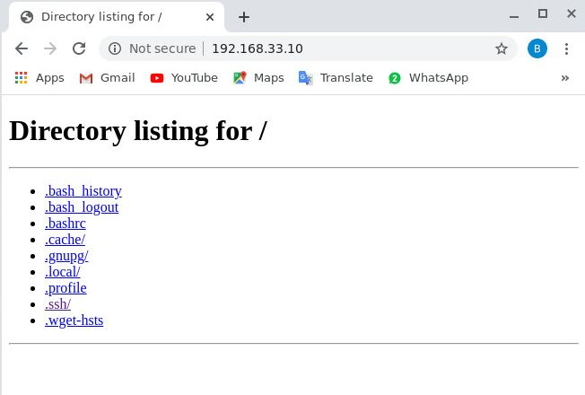
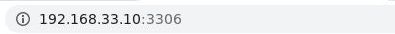

# Ejercicios para snort

## 1. Descarga en tu maquina el script setup_conf.sh   que se encuentra en este repositorio.

    vagrant@ubuntu1804:~  wget https://raw.githubusercontent.com/BrendaBarrios/snort/master/Ejercicios_Practicos/setup_conf.sh

[link a scrip setup_conf.sh](https://github.com/BrendaBarrios/snort/tree/master/Ejercicios_Practicos)

## 2. Ubicate donde se encuentra el archivo que descargaste anteriormente y ejecuta lo siguiente.

### 2.1 Otorgaremos permisos para que se pueda ejecutar.

    vagrant@ubuntu1804:~  chmod u+x setup_conf.sh

### 2.2 Ejecutaremos el script en nuestra maquina.

    vagrant@ubuntu1804:~ ./setup.sh

### 2.3 Colocaras la ip pública que esta en la interfaz de red que estamos usando.

De la interfaz de red usada localizaremos  la ip que aparece dentro de las características de la interfaz y recuerda generalmente comienzan con 192.168.x.x .

    vagrant@ubuntu1804:/vagrant_data$ ./setup_conf.sh
    Escribe la ip de tu equipo:192.168.33.10

Se ejecutara el comando y cuando este listo aparecera un _mensaje que diga terminando edición del archivo snort.conf._

## 3. Descarga el  script  conf_localRules.sh  que se encuentra en este repositorio.

    vagrant@ubuntu1804:~  wget https://raw.githubusercontent.com/BrendaBarrios/snort/master/Ejercicios_Practicos/local.rules.sh

[link a scrip conf_localRules.sh](https://github.com/BrendaBarrios/snort/tree/master/Ejercicios_Practicos)

## 4. Ubicate donde se encuentra el archivo que descargaste anteriormente y ejecuta lo siguiente.

### 4.1 Se Otorgan permisos para que se pueda ejecutar.

    vagrant@ubuntu1804:~  chmod u+x conf_localRules.sh

_Para terminar la ejecución de snort usa __ctrl + c__ se tardara un poco en cerrar._

### 4.2 Ejecutaremos el script en nuestra maquina.

    vagrant@ubuntu1804:~ ./conf_localRules.sh

# Ejecuta snort en la consola.

Para ejecutar snort en la consola usaremos el siguiente comando :

    sudo snort -A console -i eth1 -u snort -g snort -c  /etc/snort/snort.conf

Si deseas más información de las opciones que se utilizan ejecuta el siguiente comando donde te mostrara la descripcion de cada uno de ellos.

    vagrant@ubuntu1804:~$ snort --help

__IMPORTANTE__

En el ejemplo anterior __eth1 va a cambiar dependiendo de la interfaz que utilices__ recuerda que es donde esta la ip pública(192.168.x.x)  que usamos.En caso contrario snort no detectara las reglas.

Las reglas que estan en este script no son fijas cada usuario debe adecuarlas a sus necesidades.

# Ejercicios 

__Debes tener ejecutando snort en consola, las reglas que se muestran ya las tienes  escritas en el archivo de _local.rules_ con los scripts ejecutados ya no deberás escribirlas solo ver como hacerlas funcionar .__

__Snort detecta una regla si coincide mandara una alerta a la consola de snort__

#  1. Ping al servidor.

La siguiente instrucción detecta un ping desde una maquina externa hacia tu servidor o maquina.

    alert icmp $EXTERNAL_NET any -> $HOME_NET any (msg:"ping al servidor"; sid:10000001; rev:001;)

## Debes abrir una terminal donde no este instalado snort.

Por ejemplo si en una maquina virtual tienes snort puedes abrir la terminal de tu equipo original ya sea Linux o Windows y ejecutar el siguiente comando:

    bodhi@yasmin:~$ ping 192.168.33.10

_Tu deberas cambiar la ip pública por la que tu estas usando ,es decir la que utiliza en la interfaz de red que colocaste al momento de instalar snort._

## Revisa la terminal en la que tienes ejecutando snort para ver la alerta del ping.

Mostrara la alerta con el mensaje de ping al servidor.

    Commencing packet processing (pid=1685)
    04/27-19:05:37.037319  [**] [1:10000001:1] ping al servidor [**] [Priority: 0] {ICMP} 192.168.33.1 -> 192.168.33.10
    04/27-19:05:38.043472  [**] [1:10000001:1] ping al servidor [**] [Priority: 0] {ICMP} 192.168.33.1 -> 192.168.33.10
    04/27-19:05:39.049655  [**] [1:10000001:1] ping al servidor

#  2. Conexión ssh

La instrucción detecta cuando algun usuario intenta conectarse por ssh al servidor.

    alert tcp $EXTERNAL_NET any -> $HOME_NET 22 (msg:"Detectando conexión por ssh";sid:1000005; rev:005;) 

## Debes abrir una terminal donde no este instalado snort.

Por ejemplo si en una maquina virtual tienes snort puedes abrir la terminal de tu equipo original ya sea linux o windows y ejecutar el siguiente comando:

    bodhi@yasmin:~$ ssh usuario@192.168.33.10
    

_Tu deberás cambiar la ip pública por la que tu estas usando ,es decir la que utiliza en la interfaz de red que colocaste al momento de instalar snort y el usuario puedes o dejarlo asi solo para que veas la._

## Revisa la terminal en la que tienes ejecutando snort para verificar que esta mandando la alerta.

Te mostrara que snort ya esta detectando el paquete por medio de la siguiente alerta.

    Commencing packet processing (pid=2052)
    04/27-20:04:46.151672  [**] [1:1000005:5] Detectando conexión por ssh [**] [Priority: 0] {TCP} 192.168.33.1:38816 -> 192.168.33.10:22
    04/27-20:04:46.152637  [**] [1:1000005:5] Detectando conexión por ssh [**] [Priority: 0] {TCP} 192.168.33.1:38816 -> 192.168.33.10:22
    
#  3. Regla para detectar la entrada  HTTP 

Esta regla detecta cuando se conecta a http,cuando estas accediendo a una página web.

    alert tcp any any -> $HOME_NET 80 (msg:"Regla del http"; sid:10000003; rev:003;)

## Abre una nueva terminal en el equipo donde esta instalado snort

Ejecuta el siguiente comando es para generar la página que python crea automáticamente, la cual usaremos de ejemplo para esta alerta.

    vagrant@ubuntu1804:~$ sudo python3 -m http.server --bind 0.0.0.0 80

Una vez que ejecutas este comando podras verificar la página en tu navegador colocando tu ip pública y mostrara lo siguiente.

Lo anterior es realizado cuando no estas usando una instancia .

Cuando usas una instancia deberas habilitar los permisos en _security groups__

## Enseguida dirigete a la consola de snort donde te mostrara las siguiente alerta :

    04/27-20:59:26.280661  [**] [1:10000003:3] Regla del http [**] [Priority: 0] {TCP} 192.168.33.1:53704 -> 192.168.33.10:80
    04/27-20:59:26.285119  [**] [1:10000003:3] Regla del http [**] [Priority: 0] {TCP} 192.168.33.1:53704 -> 192.168.33.10:80
    04/27-20:59:26.287752  [**] [1:10000003:3] Regla del http [**] [Priority: 0] {TCP} 192.168.33.1:53704 -> 192.168.33.10:80

#  4. Regla para detectar que entran al admin  

La siguiente regla detecta cuando alguien quiere entrar al administrador de una aplicación , esto es peligroso porque puede entrar a modificara o eliminar información.

    alert tcp any any -> $HOME_NET 80 (msg:" Entrando al admin"; content:"GET /admin"; sid:10000002; rev:002;)

## Abre una nueva terminal en el equipo donde esta instalado snort

Ejecuta el siguiente comando es para generar la página que python crea automáticamente, usaremos este sitio que acederemos por medio de una url que  no existe pero nos sirve para simular como sería en un entorno real, lo hacemos asi para que todos tengamos la oportunidad de probar

    vagrant@ubuntu1804:~$ sudo python3 -m http.server --bind 0.0.0.0 80

Lo anterior es realizado cuando no estas usando una instancia.

Cuando usas una instancia deberas habilitar los permisos en _security groups__.

## Para obtener la alerta en snort coloca la siguiente url en tu navegador.

__La ip cambiara, cada usuario debe colocar la ip pública de su interfaz de red que esta utilizando.__

Si te aparece un error 404 en el navegador es normal no te asustes solo en estos momento estamos simulando la ip de un proyecto real.

## Revisa la consola donde esta snort corriendo

Como estamos accediendo a una página http y al la url /admin encontrara que concuerda con 2 reglas por lo tanto mostrara ambas alertas como las siguientes.

   
    04/28-03:02:50.877485  [**] [1:10000002:2]  Entrando al admin [**] [Priority: 0] {TCP} 192.168.33.1:55526 -> 192.168.33.10:80
    04/28-03:02:50.877485  [**] [1:10000003:3] Regla del http [**] [Priority: 0] {TCP} 192.168.33.1:55526 -> 192.168.33.10:80

Esta regla cambiara dependiendo del proyecto en el que se este trabajando, si lo realizas en una instancia debes cambiar el content por lo que tenga la petición GET de tu proyecto.Lo puedes checar inspeccionando el proyecto,enseguida te diriges a Network ,seleccionas admin en la lista de archivos que se envian por GET  y desplegara la información de esa petición en los Headers de peticiones busca lo que se esta enviando por get.

#  5. Regla para detectar intruso en la base de datos.  

Esta regla es parecida a la anterior solo cambia el puerto que es 3306 este permite el acceso a la base de datos de alguna aplicación. Si algun intruso llega a entrar puede causar grandes daños.

    alert tcp any any -> $HOME_NET 3306 (msg:"Alguien intenta entrar a la base de datos"; sid:10000004;rev:004; )

## Abre una nueva terminal en el equipo donde esta instalado snort

Seguiremos usando la página que crean python de http por defecto. Para hacerla funcionar debés ejecutar el siguiente comando:

    vagrant@ubuntu1804:~$ sudo python3 -m http.server --bind 0.0.0.0 80

Si estas en una instancia debes habilitar los puertos y cambiar los archivos de configuración de mysql.

## Enseguida coloca en tu navegador lo siguiente :

La alerta que te muestra es la siguente:

    04/28-03:54:49.635069  [**] [1:10000004:4] Alguien intenta entrar a la base de datos [**] [Priority: 0] {TCP} 192.168.33.1:35532 -> 192.168.33.10:3306
    04/28-03:54:49.866907  [**] [1:10000004:4] Alguien intenta entrar a la base de datos [**] [Priority: 0] {TCP} 192.168.33.1:35534 -> 192.168.33.10:3306
    04/28-03:54:49.874529  [**] [1:10000004:4] Alguien intenta entrar a la base de datos [**] [Priority: 0] {TCP} 192.168.33.1:35536 -> 192.168.33.10:3306

## Si deseas añadir tus propias reglas locales debes ingresar  a la siguiente directorio.

    vagrant@ubuntu1804:/$ cd /etc/snort/rules

Y abrir el archivo que modificaras
    
    vagrant@ubuntu1804:/etc/snort/rules$ sudo nano local.rules

## Al igual si necesitas importar paquetes  ingresa al siguiente dirrectorio.

    vagrant@ubuntu1804:/$ cd /etc/snort

 Y abrir el siguiente archivo que editaras :

    vagrant@ubuntu1804:/$ cd /etc/snort

Es asi como finalizamos la explicacion de cada uno de los ejercicios de snort

