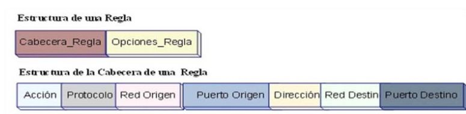

# SNORT

## ¿Qué es snort?

Snort es un Sistema de Detección de Intrusos (IDS) basado en red (IDSN) open source.

## Características

Implementa un motor de detección de ataques y barrido de puertos que nos ayuda a :
registrar, alertar y responder ante cualquier anomalía previamente definida como patrones 
que corresponden a ataques, intentos aprovechar alguna vulnerabilidad y análisis de protocolos.

Todo esto en tiempo real. Funciona bajo plataformas Windows y UNIX/Linux.

## Permite :

* Al tráfico malicioso, darlo de baja. 

* Tener una capacidad de prevención. 

* Genera tipos de respuesta a ataques.

* Aumenta seguridad.

## ¿Porqué es más usado?

Es uno de los más usados y dispone de una gran cantidad de filtros o patrones ya predefinidos, así como actualizaciones constantes ante casos de ataques.Utilizado por empresas debido a que pueden configurar sus propias reglas y solo usan las necesarias para ellos.

## Elementos de Snort

El motor de Snort se divide en los siguientes componentes:

* __Módulo de captura de tráfico__ : 
Captura todos los paquetes de la red.

* __Decodificador__ :
Forma estructura de datos con los paquetes e identifica protocolos.

* __Preprocesadores__ :
 Extiende Funcionalidades preparando los datos para la detención.

* __Motor de Detención__ :
Analiza los paquetes en base a reglas definidas para detectar ataques.

* __Archivo de reglas__ :
 Conjunto de reglas que el análisis de paquetes.

* __Plugins de detención__ :
Usan para modificar el motor de detención de snort.

* __Plugins de salida__:
Define que, como, donde se guardan las alertas de los paquetes.

# Reglas de Snort

Las reglas o firmas son los patrones que se buscan dentro de los paquetes de datos. Estas son escritas en el archivo  _local.rules_.
Cada quien coloca las que cree necesarias.Este archivo será editado cada que necesites añadir una regla.

Son utilizadas por el motor de detección para __comparar los paquetes recibidos y generar 
las alertas__ en caso de existir coincidencia entre el contenido de los paquetes y las firmas.

__La estructura de una regla es la siguiente :__

Las reglas que sean usadas por snort deberan llevar la estructura anterior. En el archivo _local.rules_ las vas a observar escritas de la siguiente manera:

<table  width="100%" height="100%">
<tr style="text-align : center;">
<td style="background-color :#e040fb;" > Acción</td>
<td style="background-color :#e040fb;"> Protocolo</td>
<td style="background-color :#e040fb;" > Red Origen</td>
<td style="background-color :#e040fb;" >Puerto origen</td>
<td style="background-color :#e040fb;">Dirección</td>
<td style="background-color :#e040fb;">Red destino</td>
<td style="background-color :#e040fb;">Puerto destino</td>

<td style="background-color :#e040fb;">msg</td>
<td style="background-color :#e040fb;">sid</td>
<td style="background-color :#e040fb;">rev</td>
</tr>

<tr>
<td>alert</td>
<td>tcp</td>
<td>$EXTERNAL_NET</td>
<td>  any</td>
<td>-></td>
<td>$HOME_NET</td>
<td>53</td>
<td> coneción DNS</td>
<td>10000001</td>
<td>001</td>
</tr></table>

__Y el significado de cada campo es el siguiente:__

• __Protocolo__. Permite establecer el protocolo de comunicaciones que se va a utilizar. Los posibles valores son: TCP, UDP, IP e ICMP.

• __Red de origen y red de destino__. Permite establecer el origen y el destino de la
comunicación. En el caso de las variables $EXTERNAL_NET y $HOME_NET para el uso de los ejemplos de este repositorio son la Ip publica que ingresaste de la interfaz de red.

• __Puerto de origen y destino__. Permite establecer los puertos origen y destino de la
comunicación. Indica el número de puerto o el rango de puertos aplicado a la dirección
de red que le precede.

• __Dirección__. Permite establecer el sentido de la comunicación. Las posibles opciones son: ->, <- y <>.

• __Acción__. Permite indicar la acción que se debe realizar sobre dicho paquete. Los posibles valores son:

__alert__: Genera una alerta usando el método de alerta seleccionado y posteriormente
loggea el paquete.

__log__: Comprueba el paquete.

__pass__: Ignora el paquete.

__activate__: Alerta y luego activa otra regla dinámica.
dynamic: Permanece ocioso hasta que se active una regla, entonces actua como un
inspector de reglas.

Seguidamente en las reglas que utilizaremos seran las siguinetes :

• __msg__: Informa al motor de alerta que mensaje debe de mostrar. Los caracteres especiales
de las reglas como : y ; deben de colocarse dentro de la opción msg con el carácter \.

• __content__ : Permite que Snort realice una búsqueda sensitiva para un contenido específico
del payload del paquete.

• __sid__:  en combinación con la opción rev, unicamente identifica una regla Snort,
correlacionando el ID de la regla individual con la revisión de la regla.No deben repetirse valores porque marcara un error.

La prioridad es un valor entero, normalmente 1 para prioridad alta, 2 para media y 3
para baja.

    alert icmp $EXTERNAL_NET any -> $HOME_NET any (msg:"ping al servidor"; sid:10000001; rev:001;)
    

# Archivo Snort.conf

En el archivo Snort.conf añade y elimina los plugins o paquetes a utilizar.

Dependiendo de las reglas utilizadas debes de importar adecuadamente la regla en este archivo para su correcto funcionamiento.

Este archivo cuando es instalado snort contiene todos los plugins pero es recomendable solo dejar importado los que necesitas y borrar todos los demás includes porque podria dar errores al momento de ejecutar.

Por este motivo para los ejercicios solo se dejaran los necesarios y para no borrar mnualmente utilizamos un script que eliminara lo que no necesitamos para la realización de la practica.

## Herramientas complementarioas para snort

Existen varias herramientas que funcionan con el uso de snort mencionaremos alguna de ellos.

__Spade:__ Módulo detector de Anomalías.

__Inline Snort :__ Sistema de Prevención de Intrusos.

__BRO :__ NIDS que usa una gran variedad de módulos para el análisis de protocolos.

__ACID :__ Consola web para visualizar los registros de Snort.

## Ventajas 

* __Puede funcionar como sniffer__:
Podemos ver en consola y en tiempo real qué ocurre en nuestra red, todo nuestro tráfico

* __Registro de paquetes__:
Permite guardar en un archivo los logs para su posterior análisis, un análisis offline.

* __Funciona como un NIDS__:
Cuando un paquete coincide con algún patrón establecido en las reglas de configuración, se loguea. 
Así se sabe cuándo, de dónde y cómo se produjo el ataque.

* __Funciona con otras herramientas__:
En función de otras herramientas genera más funcionalidades por ejemplo en función con mysql va guardando los registros en la base de datos.

