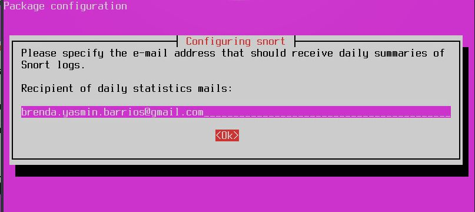

# Instalación de snort en linux

## 1. Ejecutar el siguiente comando en la consola.

Con este comando se configurara automáticamente los directorios y archivos necesario para el funcionamiento de la herramienta snort.

    vagrant@ubuntu1804:~  sudo apt-get install snort 

## 2. Después de lo anterior te aparecera una pregunta responde afirmativamente si deseas continuar con la instalación.

    Do you want to continue? [Y/n] Y

## 3. En la siguiente pantalla responde OK.

 

## 4. Coloca la interfaz de red que esta ocupando tu equipo.

 La interfaz de red  sirve para conectar a una computadora a la red y posibilita compartir recursos entre dos computadores.

 

## En caso de que no conozcas tu interfaz de red haz lo siguiente.

### 4.1 Abre una nueva terminal en el equipo que instalaras snort.

Para conocerla es necesario ejecutar el siguiente comando :

    vagrant@ubuntu1804:~  ifconfig

    eth0: flags=4163<UP,BROADCAST,RUNNING,MULTICAST>  mtu 1500
        inet 10.0.2.15  netmask 255.255.255.0  broadcast 10.0.2.255
        inet6 fe80::a00:27ff:fee3:9f67  prefixlen 64  scopeid 0x20<link>
        ether 08:00:27:e3:9f:67  txqueuelen 1000  (Ethernet)
        RX packets 1188  bytes 152059 (152.0 KB)
        RX errors 0  dropped 0  overruns 0  frame 0
        TX packets 922  bytes 124566 (124.5 KB)
        TX errors 0  dropped 0 overruns 0  carrier 0  collisions 0

    eth1: flags=4163<UP,BROADCAST,RUNNING,MULTICAST>  mtu 1500
        inet 192.168.33.10  netmask 255.255.255.0  broadcast 192.168.33.255
        inet6 fe80::a00:27ff:fe6b:6bee  prefixlen 64  scopeid 0x20<link>
        ether 08:00:27:6b:6b:ee  txqueuelen 1000  (Ethernet)
        RX packets 0  bytes 0 (0.0 B)
        RX errors 0  dropped 0  overruns 0  frame 0
        TX packets 20  bytes 1496 (1.4 KB)
        TX errors 0  dropped 0 overruns 0  carrier 0  collisions 0

    lo: flags=73<UP,LOOPBACK,RUNNING>  mtu 65536
        inet 127.0.0.1  netmask 255.0.0.0
        loop  txqueuelen 1000  (Local Loopback)
        RX packets 22  bytes 2166 (2.1 KB)
        RX errors 0  dropped 0  overruns 0  frame 0
        TX packets 22  bytes 2166 (2.1 KB)
        TX errors 0  dropped 0 overruns 0  carrier 0  collisions 0

En lo anterior hay 3 interfaces de red, debes elegir la que uses, en este caso donde se encuentre la ip publica que estas utilizando y por lo regular son las IP que _empiezan con 192.168._

En la mayoria de los casos la interfaces utilizadas son eth0 y eth1.

Una vez que identifiques el nombre de la interfaz debes colocarlo en la pantalla anterior y darle ok.En caso que pusieras una interfaz no existente snort te lo indicara.

## 5. Te aparecera una ventana informativa sobre el rango de las IPS solo ellige OK.

 

## 6. Te pedira el rango de las ip que utilizara, aqui dejaremos como aparece solo dale OK.

 

## 7. Te preguntara si deseas resivir alertas a tu correo electrónico para enviar los logs de snort. Elige la opción YES.

 

## 8. Coloca tu email.

 

## 9. Preguntara el número de ocurrencias en las que te enviara el correo electrónico colocar 1.

 

# Comprobación de la instalación de snort

La siguiente solo verifica que los paquetes de snort se encuentren instalados y este corriendo en tu maquina.

    vagrant@ubuntu1804:/vagrant_data$ sudo snort

    Running in packet dump mode

        --== Initializing Snort ==--
    Initializing Output Plugins!
        pcap DAQ configured to passive.
    Acquiring network traffic from "eth0".
    Decoding Ethernet

        --== Initialization Complete ==--

            ,,_        -*> Snort! <*-
            o"  )~   Version 2.9.7.0 GRE (Build 149)
            ''''    By Martin Roesch & The Snort Team: http://www.snort.org/contact#team
                    Copyright (C) 2014 Cisco and/or its affiliates. All rights reserved.
                    Copyright (C) 1998-2013 Sourcefire, Inc., et al.
                    Using libpcap version 1.8.1
                    Using PCRE version: 8.39 2016-06-14
                    Using ZLIB version: 1.2.11

    Commencing packet processing (pid=4257)
    04/25-04:55:38.372041 10.0.2.15:22 -> 10.0.2.2:43284
    TCP TTL:64 TOS:0x10 ID:45465 IpLen:20 DgmLen:380 DF
    ***AP*** Seq: 0xAEEA228B  Ack: 0xB45D04D6  Win: 0x8F70  TcpLen: 20
    =+=+=+=+=+=+=+=+=+=+=+=+=+=+=+=+=+=+=+=+=+=+=+=+=+=+=+=+=+=+=+=+=+=+=+=+=+

    ===============================================================================
    Run time for packet processing was 4.101934 seconds
    Snort processed 7 packets.
    Snort ran for 0 days 0 hours 0 minutes 4 seconds
    Pkts/sec:            1
    ===============================================================================
    Memory usage summary:
    Total non-mmapped bytes (arena):       786432
    Bytes in mapped regions (hblkhd):      12906496
    Total allocated space (uordblks):      686720
    Total free space (fordblks):           99712
    Topmost releasable block (keepcost):   96432
    ===============================================================================
    Breakdown by protocol (includes rebuilt packets):
            Eth:            7 (100.000%)
        VLAN:            0 (  0.000%)
            IP4:            7 (100.000%)
        Frag:            0 (  0.000%)
        ICMP:            0 (  0.000%)
            UDP:            0 (  0.000%)

    ===============================================================================
    Snort exiting

Te aparecera lo anterior que es el tráfico de la interfaz de red  y abajo te apareceran estadísticas de los paquetes.

__Para cerrar snort presiona las teclas ctrl + c tardara un poco en cerrar.__

Si te aparece lo anterior tu instalación ha sido exitosa :) .

